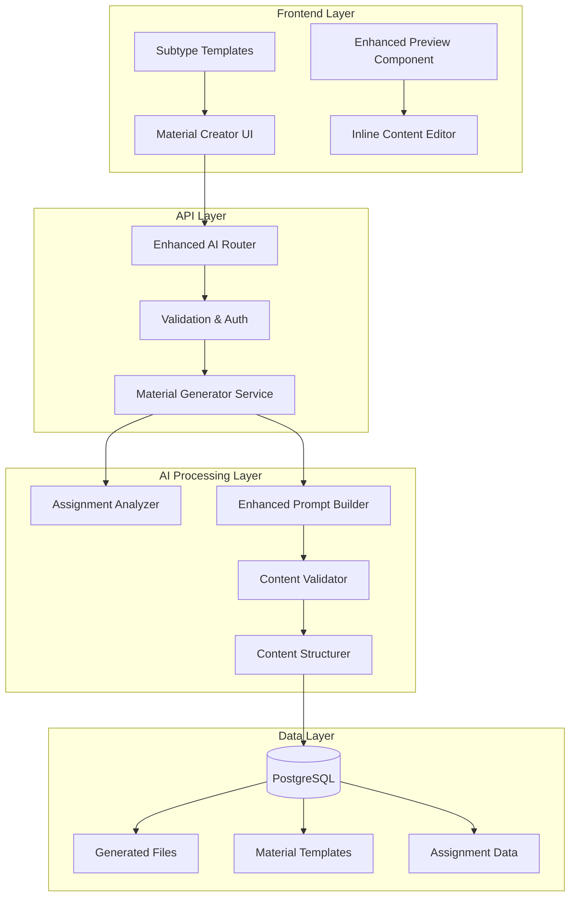

# Design Document

## Overview

The Enhanced Material Generation system will transform the existing basic AI-powered material creation into a sophisticated, intelligent platform that generates high-quality educational content. The system will support assignment-based generation, material subtypes, enhanced content structuring, and comprehensive customization options while maintaining the existing streaming architecture and user experience.

## Architecture

### High-Level Architecture



### Component Architecture

The system will be built using a modular architecture with the following key components:

1. **Assignment Analyzer**: Processes assignment descriptions to extract learning objectives, difficulty, and content requirements
2. **Enhanced Prompt Builder**: Creates sophisticated prompts based on material type, subtype, and assignment analysis
3. **Content Validator**: Ensures generated content meets quality standards and educational requirements
4. **Content Structurer**: Organizes generated content into proper educational formats with scaffolding
5. **Subtype Manager**: Handles material subtype definitions and specialized generation logic

## Components and Interfaces

### 1. Enhanced Material Creator Interface

**Location**: `frontend/src/pages/materials/MaterialCreatorPage.tsx`

**Enhancements**:
- Assignment input field with AI analysis
- Subtype selection for each material type
- Advanced parameter controls
- Real-time preview with editing capabilities
- Batch generation interface

**New Props**:
```typescript
interface EnhancedMaterialCreatorProps {
  assignmentMode?: boolean;
  batchMode?: boolean;
  onAssignmentAnalysis?: (analysis: AssignmentAnalysis) => void;
  onSubtypeSelect?: (subtype: MaterialSubtype) => void;
}

interface AssignmentAnalysis {
  suggestedMaterialTypes: MaterialType[];
  extractedObjectives: string[];
  detectedDifficulty: string;
  subjectArea: string;
  estimatedDuration: string;
}

interface MaterialSubtype {
  id: string;
  name: string;
  description: string;
  parentType: MaterialType;
  specialFields: TemplateField[];
  promptModifications: PromptModification[];
}
```

### 2. Assignment Analyzer Service

**Location**: `backend/src/services/AssignmentAnalyzer.ts`

**Purpose**: Analyzes assignment descriptions to extract educational metadata

**Interface**:
```typescript
interface AssignmentAnalyzer {
  analyzeAssignment(description: string): Promise<AssignmentAnalysis>;
  extractLearningObjectives(text: string): string[];
  detectDifficulty(text: string): DifficultyLevel;
  suggestMaterialTypes(analysis: AssignmentAnalysis): MaterialType[];
}

interface AssignmentAnalysis {
  learningObjectives: string[];
  difficulty: DifficultyLevel;
  subject: string;
  gradeLevel: string;
  estimatedDuration: string;
  keyTopics: string[];
  suggestedMaterialTypes: MaterialType[];
  confidence: number;
}
```

### 3. Enhanced Prompt Builder

**Location**: `backend/src/services/EnhancedPromptBuilder.ts`

**Purpose**: Creates sophisticated, context-aware prompts for AI generation

**Interface**:
```typescript
interface EnhancedPromptBuilder {
  buildPrompt(params: PromptBuildParams): Promise<string>;
  addSubtypeModifications(prompt: string, subtype: MaterialSubtype): string;
  addAssignmentContext(prompt: string, assignment: AssignmentAnalysis): string;
  addQualityConstraints(prompt: string, qualityLevel: QualityLevel): string;
}

interface PromptBuildParams {
  materialType: MaterialType;
  subtype?: MaterialSubtype;
  assignment?: AssignmentAnalysis;
  userInputs: Record<string, any>;
  qualityLevel: QualityLevel;
  customInstructions?: string;
}
```

### 4. Content Validator and Structurer

**Location**: `backend/src/services/ContentValidator.ts`

**Purpose**: Validates and structures generated content for educational quality

**Interface**:
```typescript
interface ContentValidator {
  validateContent(content: any, type: MaterialType): ValidationResult;
  checkEducationalQuality(content: any): QualityScore;
  validateMathematicalAccuracy(content: any): boolean;
  checkAgeAppropriateness(content: any, gradeLevel: string): boolean;
}

interface ContentStructurer {
  structureContent(content: any, type: MaterialType, subtype?: MaterialSubtype): StructuredContent;
  addScaffolding(content: any): any;
  organizeDifficultyProgression(problems: Problem[]): Problem[];
  addEducationalMetadata(content: any): any;
}
```

### 5. Material Subtype System

**Location**: `backend/src/models/MaterialSubtype.ts`

**Purpose**: Manages material subtypes and their specialized generation logic

**Database Schema**:
```sql
CREATE TABLE material_subtypes (
  id UUID PRIMARY KEY DEFAULT gen_random_uuid(),
  parent_type VARCHAR(50) NOT NULL,
  name VARCHAR(100) NOT NULL,
  description TEXT,
  special_fields JSONB,
  prompt_modifications JSONB,
  validation_rules JSONB,
  created_at TIMESTAMP DEFAULT CURRENT_TIMESTAMP,
  updated_at TIMESTAMP DEFAULT CURRENT_TIMESTAMP
);
```

## Data Models

### Enhanced Generated File Model

**Enhancements to existing `GeneratedFileModel`**:

```typescript
interface EnhancedGeneratedFile extends GeneratedFile {
  assignment_description?: string;
  assignment_analysis?: AssignmentAnalysis;
  material_subtype?: string;
  quality_score?: QualityScore;
  generation_parameters?: GenerationParameters;
  content_structure?: ContentStructure;
  educational_metadata?: EducationalMetadata;
}

interface QualityScore {
  overall: number;
  accuracy: number;
  ageAppropriateness: number;
  pedagogicalSoundness: number;
  clarity: number;
  engagement: number;
}

interface GenerationParameters {
  promptVersion: string;
  modelUsed: string;
  temperature: number;
  maxTokens: number;
  customInstructions?: string;
  subtypeModifications?: string[];
}

interface ContentStructure {
  sections: ContentSection[];
  scaffolding: ScaffoldingElement[];
  difficultyProgression: DifficultyLevel[];
  learningObjectiveMapping: ObjectiveMapping[];
}

interface EducationalMetadata {
  bloomsTaxonomyLevels: string[];
  learningStyles: string[];
  assessmentType: string;
  differentiationOptions: string[];
  prerequisiteKnowledge: string[];
}
```

### Material Subtype Definitions

**Worksheet Subtypes**:
```typescript
const WORKSHEET_SUBTYPES: MaterialSubtype[] = [
  {
    id: 'practice-problems',
    name: 'Cvičné úlohy',
    description: 'Strukturované cvičení pro procvičování nových dovedností',
    parentType: 'worksheet',
    specialFields: [
      { name: 'problemTypes', type: 'multiselect', options: ['výpočty', 'slovní úlohy', 'aplikace'] },
      { name: 'scaffoldingLevel', type: 'select', options: ['minimální', 'střední', 'vysoké'] }
    ],
    promptModifications: [
      'Zaměř se na postupné zvyšování obtížnosti',
      'Poskytni jasné kroky řešení pro první úlohy',
      'Zahrň různé typy problémů pro komplexní pochopení'
    ]
  },
  {
    id: 'homework-assignment',
    name: 'Domácí úkol',
    description: 'Samostatná práce pro upevnění učiva',
    parentType: 'worksheet',
    specialFields: [
      { name: 'timeEstimate', type: 'select', options: ['15 min', '30 min', '45 min', '60 min'] },
      { name: 'parentGuidance', type: 'boolean', label: 'Zahrnout pokyny pro rodiče' }
    ],
    promptModifications: [
      'Vytvoř úlohy vhodné pro samostatnou práce doma',
      'Zahrň jasné instrukce a očekávané výsledky',
      'Přidej tipy pro rodiče, jak pomoci'
    ]
  }
  // ... more subtypes
];
```

## Error Handling

### Enhanced Error Handling Strategy

1. **Assignment Analysis Errors**:
   - Fallback to manual parameter input if analysis fails
   - Provide suggestions based on partial analysis
   - Log analysis failures for improvement

2. **Content Generation Errors**:
   - Retry with simplified prompts
   - Fallback to basic generation mode
   - Provide partial results when possible

3. **Validation Errors**:
   - Highlight specific quality issues
   - Offer regeneration options
   - Allow manual corrections

4. **Subtype Errors**:
   - Fallback to parent material type
   - Provide error-specific guidance
   - Maintain user's input data

**Error Response Format**:
```typescript
interface EnhancedErrorResponse {
  type: 'assignment_analysis' | 'generation' | 'validation' | 'subtype';
  message: string;
  details?: any;
  suggestions?: string[];
  fallbackOptions?: FallbackOption[];
  retryable: boolean;
}

interface FallbackOption {
  id: string;
  name: string;
  description: string;
  action: () => void;
}
```

## Testing Strategy

### Unit Testing

1. **Assignment Analyzer Tests**:
   - Test objective extraction accuracy
   - Validate difficulty detection
   - Test material type suggestions

2. **Prompt Builder Tests**:
   - Verify prompt construction logic
   - Test subtype modifications
   - Validate assignment context integration

3. **Content Validator Tests**:
   - Test educational quality metrics
   - Validate mathematical accuracy checking
   - Test age-appropriateness detection

### Integration Testing

1. **End-to-End Generation Flow**:
   - Test complete assignment-to-material pipeline
   - Validate subtype-specific generation
   - Test batch generation functionality

2. **API Integration Tests**:
   - Test enhanced streaming endpoints
   - Validate error handling flows
   - Test concurrent generation requests

### Quality Assurance Testing

1. **Educational Content Quality**:
   - Manual review of generated materials
   - Teacher feedback collection
   - Student comprehension testing

2. **AI Output Consistency**:
   - Test prompt variations
   - Validate output format consistency
   - Test edge case handling

## Performance Considerations

### Optimization Strategies

1. **Prompt Optimization**:
   - Cache frequently used prompt templates
   - Optimize prompt length for faster processing
   - Use prompt versioning for A/B testing

2. **Content Caching**:
   - Cache assignment analysis results
   - Store subtype templates in memory
   - Cache validation rules and patterns

3. **Streaming Enhancements**:
   - Implement progressive content delivery
   - Add compression for large responses
   - Optimize chunk size for better UX

4. **Database Optimization**:
   - Index frequently queried fields
   - Optimize JSON field queries
   - Implement connection pooling

### Scalability Measures

1. **Horizontal Scaling**:
   - Stateless service design
   - Load balancer compatibility
   - Database read replicas

2. **Resource Management**:
   - AI API rate limiting
   - Credit-based usage control
   - Queue management for batch operations

## Security Considerations

### Data Protection

1. **Assignment Data Security**:
   - Encrypt sensitive assignment descriptions
   - Implement data retention policies
   - Secure API endpoints

2. **Generated Content Security**:
   - Content sanitization
   - Malicious content detection
   - User data isolation

### AI Safety Measures

1. **Content Filtering**:
   - Inappropriate content detection
   - Bias detection and mitigation
   - Factual accuracy verification

2. **Usage Monitoring**:
   - Generation pattern analysis
   - Abuse detection
   - Quality degradation alerts